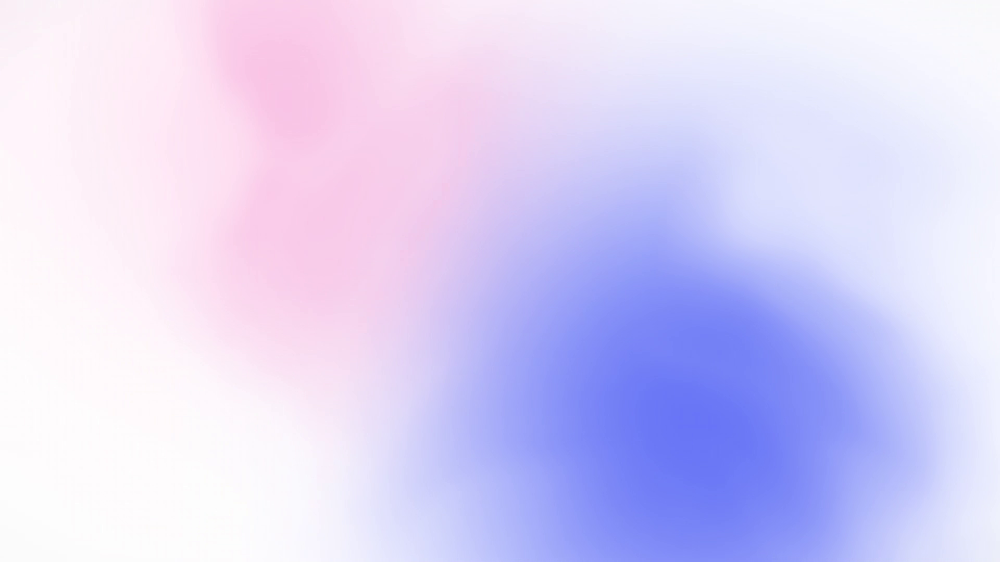

# glass-fluid

A seamless looping video background generator. Pure WebGL2 fluid shader
running headless in Chrome via Puppeteer, with a recording pipeline that
produces a 1920×1080 mp4 in seconds.

The shipped look is a soft-glass aesthetic (pink upper-left blob, indigo
lower-right blob, white base, 2-zone Gaussian mesh), but the same engine
ships 6 other palettes — synthwave, glass, ice, tech, tron, vaporwave.



## What's here

| File                  | Purpose                                                          |
| --------------------- | ---------------------------------------------------------------- |
| `auto-fluid.html`     | Self-running fluid (10s loop or `?continuous=1` for N-second).  |
| `fluid-demo.html`     | Mouse-reactive version with control panel.                       |
| `wave.html`           | Earlier pure CSS / SVG wave (kept for reference).                |
| `record.js`           | Record N seconds via Chrome DevTools screencast → mp4.           |
| `capture.js`          | Single-frame capture (debug).                                    |
| `verify-fluid.js`     | Headless probe for the WebGL pipeline.                           |
| `verify-loop.js`      | PSNR check between head and tail frames (loop validation).      |
| `package.json`        | ESM, depends only on `puppeteer-core`.                           |

## Two render modes

- **Periodic (default)** — 10 s perfect loop. Shader time is wrapped by
  `sin(t·2π)`, so the visual at `t=0` is identical to `t=10s`. Use this
  for `<video loop>` backgrounds, kiosks, anything that needs to play
  forever.
- **Continuous (`?continuous=1`)** — Time is monotonic seconds fed
  straight into the fbm domain-warp offsets, so every frame is at a
  unique position in noise space. Use this for one-shot 30 s / 60 s /
  5 min clips where repetition would be visible.

## Palettes

Defined in `auto-fluid.html` → `PALETTES` object. Each palette is 5 RGB
triples `(c1..c5)`. The default 5-color blend is a fluid interpolation
across the screen, but the `glass` palette uses a custom 2-zone Gaussian
mesh in `FRAG_MAIN_MESH_BLEND` instead — pink center `(0.26, 0.78)`,
indigo center `(0.70, 0.24)`, white base, both falloff on aspect-corrected
distance so blobs stay circular on a 16:9 screen.

| Key         | Mood                              | Best for                       |
| ----------- | --------------------------------- | ------------------------------ |
| `glass`     | white + soft pink + indigo        | iOS / Apple Vision Pro feel    |
| `ice`       | white + pale blue + aqua          | holographic, glassmorphism     |
| `tech`      | pale sky + electric blue + mint   | Linear / Vercel / SaaS         |
| `tron`      | navy + cyan + white               | AI / HUD / neon dark themes    |
| `vaporwave` | deep purple + magenta + cyan      | 80s synthwave, retro           |
| `sunset`    | purple + hot pink + orange + yellow | warm gradient, golden hour  |
| `outrun`    | purple + magenta + gold + cyan    | 80s arcade                     |

Switch palettes in browser via the top-center chip bar, or via URL:
`auto-fluid.html?p=ice`.

## Recording

```bash
# 10 s perfect loop, default palette (glass)
node record.js

# 10 s loop, ice palette
node record.js ice auto-fluid-ice.mp4

# 60 s of unique continuous motion
node record.js glass out-60s.mp4 95 1
#                                ↑   ↑
#                                |   └─ continuous mode
#                                └───── record 95 s of wall time
#                                      (Chrome soft-renders ~20 fps;
#                                       95 s × 20 fps = 1900 raw frames
#                                       → 60 s @ 30 fps after ffmpeg)
```

The script writes raw PNGs to `frames/`, then composes them with
`ffmpeg` (libopenh264, 8 Mbit/s) into the output mp4. The
`frames/` directory is ~1.4 GB per 60 s render — keep it out of git
(see `.gitignore`).

## Loop stitching for long backgrounds

Since the shader IS a 10 s loop, a 1 hour background is just
`ffmpeg -stream_loop 359 -i auto-fluid-10s.mp4 -c copy hour.mp4` —
instant, zero quality loss. File size scales 0.35 MB/s.

## Requirements

- Node 18+ (ESM)
- Chrome at `C:\Program Files\Google\Chrome\Application\chrome.exe`
  (override in `record.js` if elsewhere)
- `ffmpeg` somewhere on PATH (or hard-code the path in `record.js`)
- Headless Chrome needs `preserveDrawingBuffer: true` on the WebGL
  context (already set in `auto-fluid.html`) so the screencast can
  read it back

## Known limits

- Headless Chrome software-renders WebGL2 at ~20 fps on most machines.
  For 60 s @ 30 fps outputs, record for ~90 s of wall time.
- No `libx264` in the build of `ffmpeg` shipped here; we use
  `libopenh264` at 8 Mbit/s, which is fine for screen-capture content.
- The "vaporwave" palette on the 5-color blend produces a focused
  "trail" of color where the virtual mouse currently is; the `glass`
  palette is calmer and does not.
